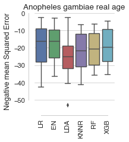
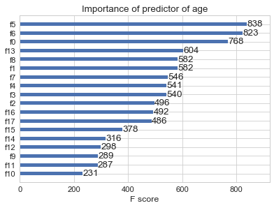

Predicting both age and species of *Anopheles gambiae* and *Anopheles arabiensis* from mid-infrared spectra
===========================================================================================================

Predicting SPECIES
------------------

### Spot-checking baseline performance of various algorithms

To determine which algorithm may be best suited to identifying the species of a mosquito based on its MIRS and to identify its age age class, we first compared the baseline performance of 6 major algorithms, linear regression, nearest neighbours, ensemble decisions trees, or Naïve Bayes.

With output category consisting of ages [1, 3, 5, 7, 9, old], XGB achieved the best prediction accuracy at baseline settings:

### Optimising XGBoost model

Support Vector machines and eXtreme Gradient Boost achieved highest performance when predicting mosquito species. After tuning using repeated stratified random under-sampling, XGB achieved 95.49% ± 0.14% accuracy on average.

### Top XGBoost features

Four wavelengths stood out as being particularly important to the prediction:['1901', '1026', '401', '3856'].

Ranked by decreasing importance:

Predicting AGE
==============

Predicting age for *A. gambiae*, as classification
--------------------------------------------------

### Spot-checking baseline performance of various algorithms

With output category consisting of ages [1, 3, 5, 7, 9, old], XGB achieved the best prediction accuracy at baseline settings:

Logistic regression provides the most accurate prediction.

### Optimising Logistic regression models

#### Per class prediction accuracy

#### Top features

Ranked by decreasing importance:

Predicting age for *A. gambiae*, as regression
----------------------------------------------

### Spot-checking baseline performance of various algorithms

With output category consisting of ages as continuous variable, Elastic Nets and Logistic regression achieved the best prediction accuracy at baseline settings:

### Optimising Elastic Nets

Predicting age of AR, as classification
---------------------------------------

#### Spot-checking baseline performance of various algorithms

With output category consisting of ages [1, 3, 5, 7, 9, old], XGB achieved the best prediction accuracy at baseline settings:

#### After tuning XGBoost parameters

#### Confusion matrix

#### Top features

Ranked by decreasing importance:

Three wavelengths stood out as being particularly important to the prediction: '1900.76462', '1745.50175', '3855.53371'

### Conclusions

1.	Predicting age and species at the same time yields an accuracy of **47%**.
2.	However, using the full dataset (which includes *Anopheles gambiae* and *Anopheles arabiensis*), to predict species alone achieves **85.25%** accuracy (xgboost)
3.	predicting age using both AG and AR achieves **52%** accuracy
4.	predicting age using AG only achieves **71%** accuracy
5.	predicting age using AR only achieves **71.5%** accuracy
