# Predicting both age and species of *Anopheles gambiae* and *Anopheles arabiensis* from mid-infrared spectra

## Predicting SPECIES

### Spot-checking baseline performance of various algorithms

To determine which algorithm may be best suited to identifying the species of a mosquito based on its MIRS and to identify its age age class, we first compared the baseline performance of 6 major algorithms, linear regression, nearest neighbours, ensemble decisions trees, or Naïve Bayes.

With output category consisting of ages [1, 3, 5, 7, 9, old], XGB achieved the best prediction accuracy at baseline settings:

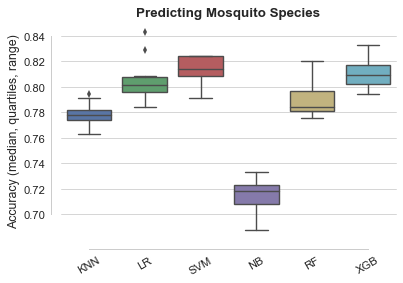

### Optimising XGBoost model

Support Vector machines and eXtreme Gradient Boost achieved highest performance when predicting mosquito species. After tuning using repeated stratified random under-sampling, XGB achieved 98.11% ± 0.11% accuracy on average.

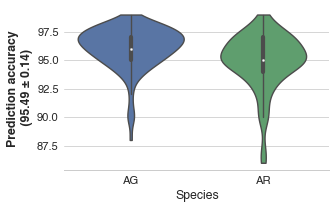

### Top XGBoost features

Four wavelengths stood out as being particularly important to the prediction:['1901', '1026', '401', '3856'].

Ranked by decreasing importance:

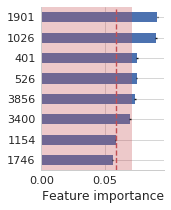

## Predicting AGE

### Predicting age for *A. gambiae*, as regression

#### Spot-checking baseline performance of various algorithms

With output category consisting of ages as continuous variable, Elastic Nets and Logistic regression achieved the best prediction accuracy at baseline settings:

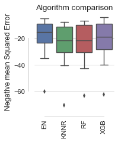

#### Optimising Elastic Nets

Elastic Nets achieved on average an MSE of 14.7 ± 0.3.

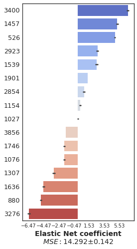

#### Optimising XGBoost

XGBoost models achieved on average an MSE of 15.0 ± 0.2

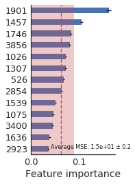

### Predicting age of *Anopheles arabiensis* as regression

#### Spot-checking baseline performance of various algorithms

With output category consisting of ages as continuous variable, Elastic Nets and Logistic regression achieved the best prediction accuracy at baseline settings:

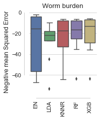

#### Optimising Elastic Nets

Elastic Nets achieved on average an MSE of 14.72 ± 0.26.

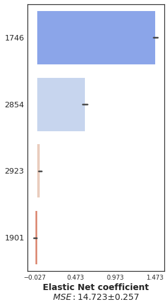

#### Optimising XGBoost

XGBoost models achieved on average an MSE of 13 ± 0.2.

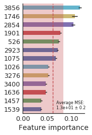

## Classification approach

### Predicting age for *A. gambiae*, as classification

#### Spot-checking baseline performance of various algorithms

With output category consisting of ages [1, 3, 5, 7, 9, old], XGB achieved the best prediction accuracy at baseline settings:

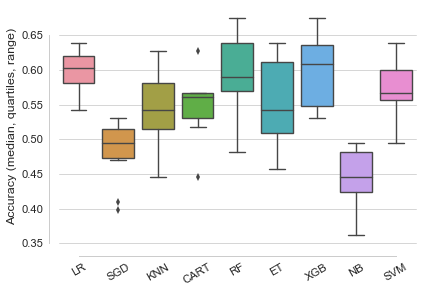

Logistic regression provides the most accurate prediction.

#### Optimising Logistic regression models

#### Per class prediction accuracy

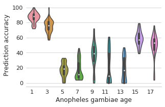

#### Top features

Ranked by decreasing importance:

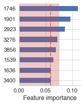

### Predicting age of AR, as classification

#### Spot-checking baseline performance of various algorithms

With output category consisting of ages [1, 3, 5, 7, 9, old], XGB achieved the best prediction accuracy at baseline settings:

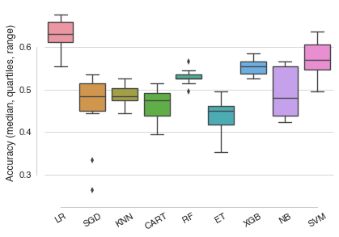

#### Tuning logistic regression

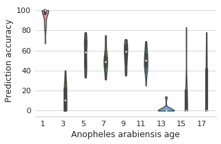

#### After tuning XGBoost parameters

#### Confusion matrix

Note: the confursion matrix shows the output of one model only. To get a representation of how models trained on different train/test splits of the data perform, we can use a plot as shown above [for AG](plots/lr_AG_age_per_class_acc_distrib.png).

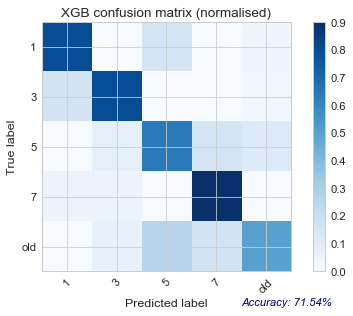

#### Top features

Ranked by decreasing importance (alternative way ofrepresenting these data):

