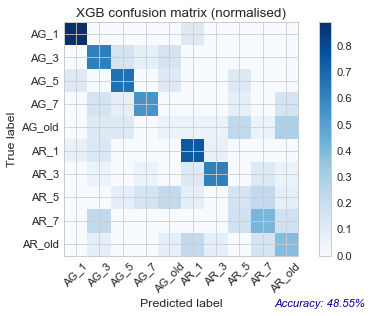
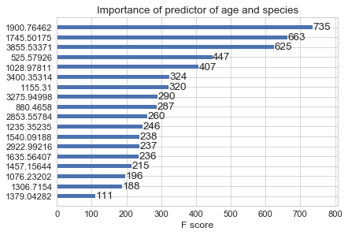

# Predicting  both age and species of *Anopheles gambiae* and *Anopheles arabiensis* from near-infrared spectra

## Statistical learning

Many algorithms have been developed over the years. Because it is very hard to
predict which one will do justice to the specific data we have, it is useful to
try out representative members of the big 'families' of algorithms, e.g. those
based on linear regression, nearest neighbours, decisions trees, or bayesian.

Algorithms used here are:

- LR: logistic regression
- SGD: stochastic gradient descent
- KNN: k nearest neighbours
- CART: classification and regression trees
- RF: random forests
- ET: extra trees
- XGB: extreme gradient boosting
- NB: gaussian naive bayes
- SVM: support vector machines

### Predicting species and age at the same time

This concatenates species and age as a single label.

#### Spot-checking baseline performance of various algorithms

With output category consisting of ages [1, 3, 5, 7, 9, old], XGB achieved the
best prediction accuracy at baseline settings:

#### After tuning XGBoost parameters

Accuracy on test set:47.83%

Classification report:

|Species_Age| precision | recall | f1-score | support|
|:-----------|:----------|:-------|:---------|:-------|     
|AG_1        | 0.58      | 0.78   | 0.67     | 9|       
|AG_3        | 0.36      | 0.62   | 0.46     | 13|      
|AG_5        | 0.50      | 0.81   | 0.62     | 16|      
|AG_7        | 0.45      | 0.38   | 0.42     | 13|      
|AG_old      | 0.45      | 0.28   | 0.34     | 18|      
|AR_1        | 0.88      | 0.41   | 0.56     | 17|      
|AR_3        | 0.40      | 0.67   | 0.50     | 9|       
|AR_5        | 0.44      | 0.31   | 0.36     | 13|      
|AR_7        | 0.47      | 0.41   | 0.44     | 17|      
|AR_old      | 0.44      | 0.31   | 0.36     | 13|      
|avg / total | 0.51      | 0.48   | 0.47     | 138|     

#### Confusion matrix

#### Top features

Three wavelengths stood out as being particularly important to the prediction:
['1900.76462', '3855.53371', '1745.50175'].

Ranked by decreasing importance:

### Predicting species only
This uses the binary label for species (AG or )
