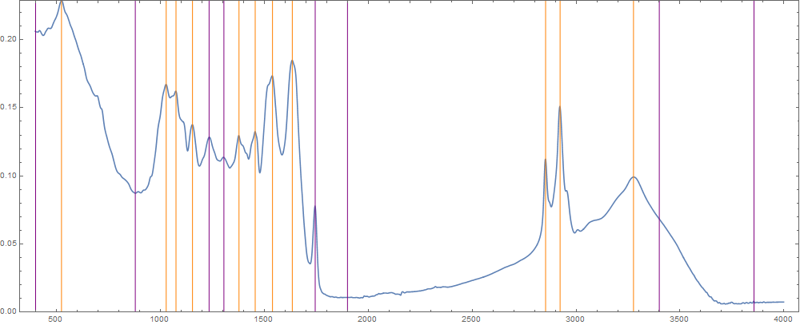

1. **mosquitoes_spectra_AG_ages.dat**: This is the matrix with the data of
Anopheles gambiae that gave us an accuracy of 59% with some differences: I have
included more information from the spectra as you can see in the following
figure:

The orange lines show the peaks that I
selected for the original matrix. The purple lines show the new selected
wavenumbers. There are 4 wn selected (3855.53, 1900.76, 880.46, 401.17 cm-1) as
"contrasts", three new peaks added (1745.50, 1306.72, 1235.35 cm-1. Please, be
careful with the peak at 1745 cm-1, when I measured the mosquitoes I observed
that it didn't depend on the age, if you see that the computer cannot deal with
it, remove its column. I have added it just in case it turns out to be very
important) and the position where the liquid water has a maximum (3400 cm-1) was
also added to inform the computer about the influence of the dryness of the
mosquito on the most important peak according to your analysis (the peak of the
amine at 3275.95 cm-1). I also have added how much time the mosquitoes were
stored since they were killed, just in case that information proves to be
relevant.

2. **mosquioes_spectra_OnlySpecies.dat**: This matrix contains the info for the two different species that we have measured, anopheles gambiae (AG) and anopheles arabiensis (AR), to see if the computer is able to learn to differentiate them.

3. **mosquitoes_spectra_SpeciesAndAges.dat**: This is the same matrix than the previous one but I have added the age of each mosquito, just in case you want to try to test both variables at the same time.
