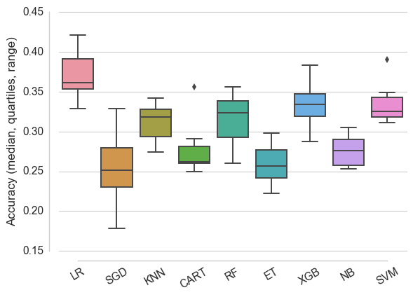
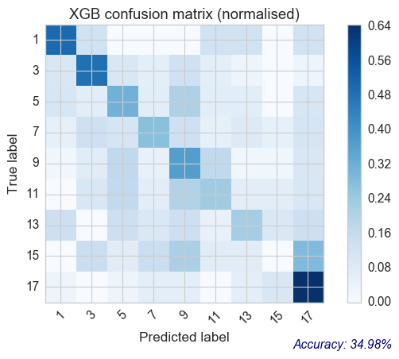
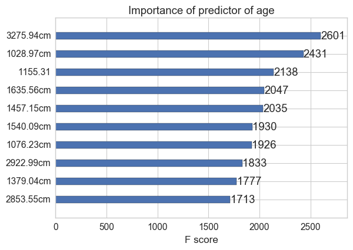
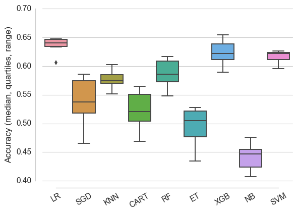
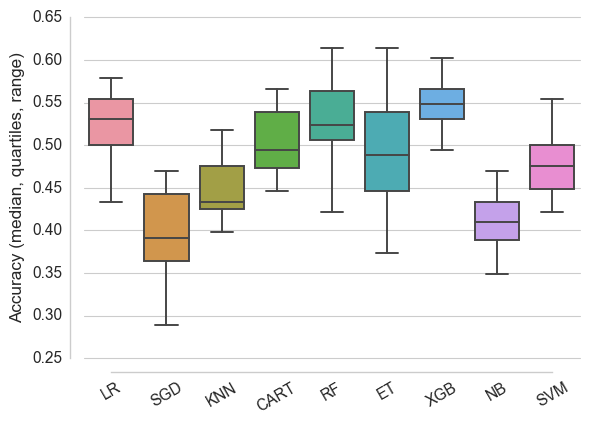
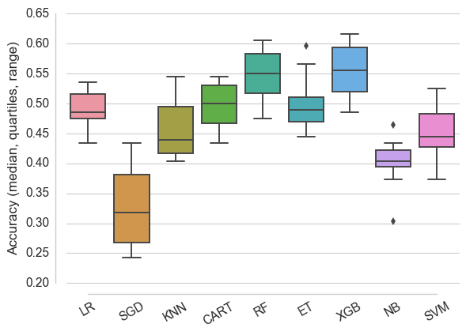
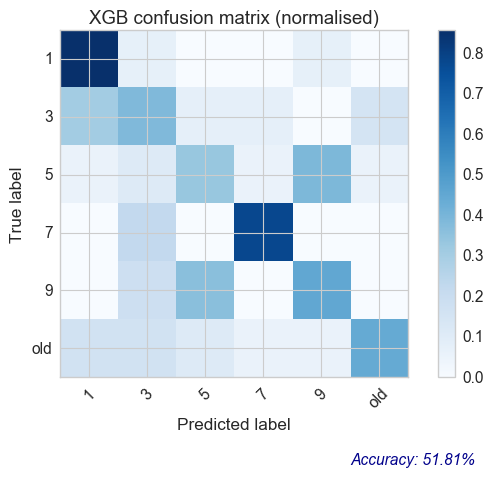

# Predicting mosquito age from near-infrared spectra ## Statistical learning
Many algorithms have been developed over the years. Because it is very hard to
predict which one will do justice to the specific data we have, it is useful to
try out representative members of the big 'families' of algorithms, e.g. those
based on linear regression, nearest neighbours, decisions trees, or bayesian.

Algorithms used here are:

- LR: logistic regression
- SGD: stochastic gradient descent
- KNN: k nearest neighbours
- CART: classification and regression trees
- RF: random forests
- ET: extra trees
- XGB: extreme gradient boosting
- NB: gaussian naive bayes
- SVM: support vector machines

### Using full age ranges.  

#### Spot-checking baseline performance of various algorithms

With output category consisting of ages [1, 3, 5, 7, 9, 11, 13, 15,
17], prediction accuracy was quite poor at baseline settings:

While logistic regression ("LR") performs slightly better here, being slightly
more opaque than the second best (extreme gradient boosting, XGB), I took the
latter further through the optimisation process.

#### After tuning XGBoost parameters

**Accuracy on test set:34.98%**

Classification report:

| age         | precision | recall | f1-score | support |
|:------------|:----------|:-------|:---------|:--------|
| 1           | 0.24      | 0.50   | 0.32     | 8       |
| 3           | 0.48      | 0.48   | 0.48     | 31      |
| 5           | 0.27      | 0.31   | 0.29     | 29      |
| 7           | 0.42      | 0.27   | 0.33     | 37      |
| 9           | 0.34      | 0.37   | 0.35     | 41      |
| 11          | 0.30      | 0.23   | 0.26     | 30      |
| 13          | 0.28      | 0.23   | 0.25     | 22      |
| 15          | 0.00      | 0.00   | 0.00     | 14      |
| 17          | 0.47      | 0.65   | 0.54     | 31      |
| avg / total | 0.35      | 0.35   | 0.34     | 243     |

Performance is quite evenly spread out over all age classes, except 15 day old mossies, which XGB misses completely. This can be visualised as follows:

I ranked the different features according to their importance in predicting mossie age in the model above...:

### Binning mossies ages ≥ 9

#### Spot-checking baseline performance of various algorithms

With output category consisting of ages [1, 3, 5, 7, 9, old], prediction
accuracy was **high** at baseline settings:

XGB performed best.

#### After tuning XGBoost parameters

Accuracy on test set:62.96%

Classification report:

| age         | precision | recall | f1-score | support |
|:------------|:----------|:-------|:---------|:--------|
| 1           | 0.27      | 0.38   | 0.32     | 8       |
| 3           | 0.56      | 0.29   | 0.38     | 31      |
| 5           | 0.67      | 0.14   | 0.23     | 29      |
| 7           | 0.56      | 0.14   | 0.22     | 37      |
| old         | 0.66      | 0.96   | 0.78     | 138     |
| avg / total | 0.62      | 0.63   | 0.56     | 243     |

Performance is **NOT** evenly spread out over all age classes. This can be visualised as follows:

This is due to the imbalance between groups... Here a number of options are available, but the most conservative is likely to be to randomly under sample the majority group ("old").

### Binning mossies ages ≥ 9 + random under-sampling

#### Spot-checking baseline performance of various algorithms

With output category consisting of ages [1, 3, 5, 7, old], prediction accuracy was **high** at baseline settings:

XGB performed best.

#### After tuning XGBoost parameters

**Accuracy on test set:59.42%**

Classification report:

| age         | precision | recall | f1-score | support |
|:------------|:----------|:-------|:---------|:--------|
| 1           | 0.68      | 0.87   | 0.76     | 15      |
| 3           | 0.77      | 0.62   | 0.69     | 16      |
| 5           | 0.64      | 0.47   | 0.54     | 15      |
| 7           | 0.38      | 0.67   | 0.48     | 9       |
| old         | 0.50      | 0.36   | 0.42     | 14      |
| avg / total | 0.62      | 0.59   | 0.59     | 69      |

Note that this rebalances all groups, as can be seen in the "support" column.

This also rebalances prediction accuracy over all age classes. This can be
visualised as follows:

### Binning mossies ages ≥ 11 + random under-sampling

Due to similar problems with unbalanced group sizes as above, it was necessary to under sample majority groups.

#### Spot-checking baseline performance of various algorithms With output

Category consisting of ages [1, 3, 5, 7, 9, old], prediction accuracy was
**high** at baseline settings:

XGB performed best.

#### After tuning XGBoost parameters

Accuracy on test set:51.81%

Classification report:

| age         | precision | recall | f1-score | support |
|:------------|:----------|:-------|:---------|:--------|
| 1           | 0.60      | 0.86   | 0.71     | 14      |
| 3           | 0.33      | 0.38   | 0.36     | 13      |
| 5           | 0.46      | 0.33   | 0.39     | 18      |
| 7           | 0.70      | 0.78   | 0.74     | 9       |
| 9           | 0.36      | 0.45   | 0.40     | 11      |
| old         | 0.73      | 0.44   | 0.55     | 18      |
| avg / total | 0.53      | 0.52   | 0.51     | 83      |

Note that this rebalances all groups, as can be seen in the "support" column.

This also rebalances prediction accuracy over all age classes. This can be
visualised as follows:

## Conclusions thus far

Extreme gradient boosting performs best on these data. The best compromise
between granularity and accuracy for each age class was obtained when ages ≥9
days were binned together, and preprocessing measures were taken to avoid
imbalance.
